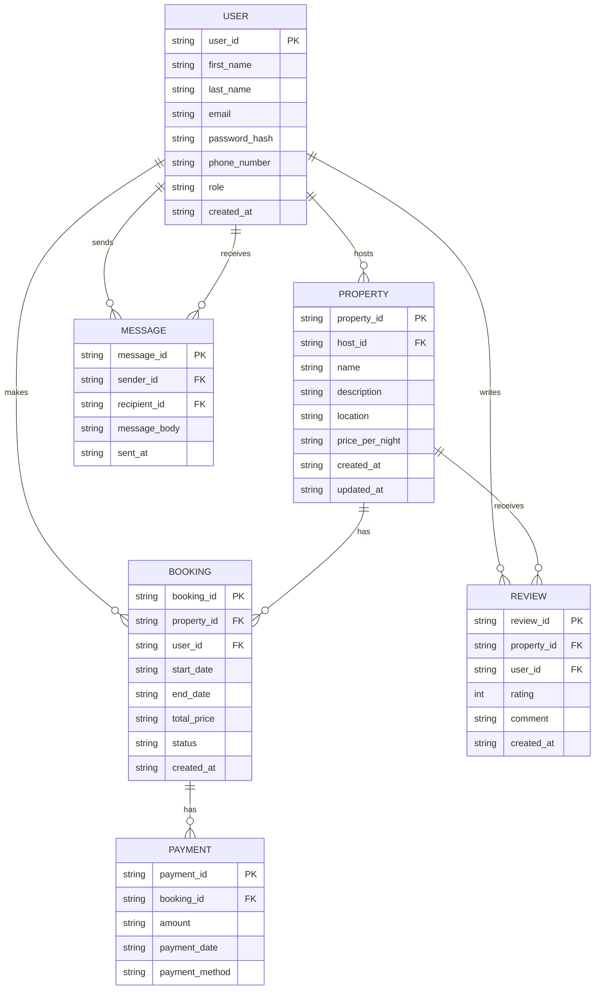

# Database Schema ERD

## Entities and Attributes

### User
- **user_id**: Primary Key, UUID, Indexed  
- first_name: VARCHAR, NOT NULL  
- last_name: VARCHAR, NOT NULL  
- email: VARCHAR, UNIQUE, NOT NULL  
- password_hash: VARCHAR, NOT NULL  
- phone_number: VARCHAR, NULL  
- role: ENUM (guest, host, admin), NOT NULL  
- created_at: TIMESTAMP, DEFAULT CURRENT_TIMESTAMP  

### Property
- **property_id**: Primary Key, UUID, Indexed  
- host_id: Foreign Key, references User(user_id)  
- name: VARCHAR, NOT NULL  
- description: TEXT, NOT NULL  
- location: VARCHAR, NOT NULL  
- price_per_night: DECIMAL, NOT NULL  
- created_at: TIMESTAMP, DEFAULT CURRENT_TIMESTAMP  
- updated_at: TIMESTAMP, ON UPDATE CURRENT_TIMESTAMP  

### Booking
- **booking_id**: Primary Key, UUID, Indexed  
- property_id: Foreign Key, references Property(property_id)  
- user_id: Foreign Key, references User(user_id)  
- start_date: DATE, NOT NULL  
- end_date: DATE, NOT NULL  
- total_price: DECIMAL, NOT NULL  
- status: ENUM (pending, confirmed, canceled), NOT NULL  
- created_at: TIMESTAMP, DEFAULT CURRENT_TIMESTAMP  

### Payment
- **payment_id**: Primary Key, UUID, Indexed  
- booking_id: Foreign Key, references Booking(booking_id)  
- amount: DECIMAL, NOT NULL  
- payment_date: TIMESTAMP, DEFAULT CURRENT_TIMESTAMP  
- payment_method: ENUM (credit_card, paypal, stripe), NOT NULL  

### Review
- **review_id**: Primary Key, UUID, Indexed  
- property_id: Foreign Key, references Property(property_id)  
- user_id: Foreign Key, references User(user_id)  
- rating: INTEGER, CHECK (1 <= rating <= 5), NOT NULL  
- comment: TEXT, NOT NULL  
- created_at: TIMESTAMP, DEFAULT CURRENT_TIMESTAMP  

### Message
- **message_id**: Primary Key, UUID, Indexed  
- sender_id: Foreign Key, references User(user_id)  
- recipient_id: Foreign Key, references User(user_id)  
- message_body: TEXT, NOT NULL  
- sent_at: TIMESTAMP, DEFAULT CURRENT_TIMESTAMP  

---

## Constraints
### User Table
- Unique constraint on email  
- Non-null constraints on required fields  

### Property Table
- Foreign key constraint on host_id  
- Non-null constraints on essential attributes  

### Booking Table
- Foreign key constraints on property_id and user_id  
- status must be one of (pending, confirmed, canceled)  

### Payment Table
- Foreign key constraint on booking_id, ensuring payment is linked to valid bookings  

### Review Table
- Constraints on rating values (1–5)  
- Foreign key constraints on property_id and user_id  

### Message Table
- Foreign key constraints on sender_id and recipient_id  

---

## Indexing
- **Primary Keys**: Indexed automatically  
- **Additional Indexes**:  
  - `email` in User table  
  - `property_id` in Property and Booking tables  
  - `booking_id` in Booking and Payment tables  

---

## Relationships
1. **User – Property**: One user (host) can list many properties (1:N)  
2. **User – Booking**: One user (guest) can make many bookings (1:N)  
3. **Property – Booking**: One property can have many bookings (1:N)  
4. **Booking – Payment**: One booking can have many payments (1:N)  
5. **User – Review – Property**: Many-to-many resolved via Review table  
6. **User – Message – User**: Many-to-many resolved via Message table  

---

## ER Diagram (Mermaid)

---

## ER Diagram File
The detailed ER diagram is available on google drive link below:  
- `Database Schema ERD` (open on [link](https://drive.google.com/file/d/1RlfwO7LJKc_1PbDejNjaAkjFHzSI42jP/view?usp=sharing))
